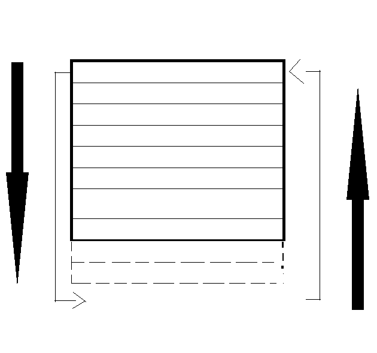

# recyleTheDom



**The basic process**

1. Initialize your runway

```javascript
var newElement;

for (var i = 0; i < RUNWAY_SIZE; i++) {
    newElement = document.createElement("tr"); //or whatever else you want
    newElement.innerHTML = createRowHtml(data[i]); //
    baseNode.appendChild(newElement);
}
```

2. Insert filler divs to simulate large scrollable area

```javascript
var emptyDiv = document.createElement("div"),
    emptyDivHeight = (data.length - RUNWAY_SIZE) * AVG_SIZE_OF_ELEMENTS;
emptyDiv.style.cssText = `height: ${emptyDivHeight}px;`;
emptyDiv.className = "emptyDiv";
baseNode.appendChild(emptyDiv);
```

3. Create data structure to hold which elements are currently on screen

```javascript
var newElement, position = 0, renderedRows = [];

renderedRows.push(position);
for (var i = 0; i < RUNWAY_SIZE; i++) {
    newElement = document.createElement("tr"); //or whatever else you want
    newElement.innerHTML = createRowHtml(data[i]); //
    baseNode.appendChild(newElement);
    position += AVG_SIZE_OF_ELEMENTS;
    renderedRows.push(position);
}
```
4. Attach scroll event to containing dom node and update the viewport as necessary

```javascript
containingNode.addEventListener("scroll", onScroll);

onScroll = function() {
    var currentScroll = containingNode.scrollTop,
        topDisplayedRenderPosition = roundDownToNearestPosition(currentScroll),
        swapRow;
    if (currentScroll > lastScroll) {
        for (var i = topDisplayedRenderPosition; i < topDisplayedRenderPosition + TINKER_WITH_THIS_NUMBER; i += AVG_SIZE_OF_ELEMENTS) {
            if (currentlyRenderedRows.indexOf(i + (NUM_ELEMENTS_TO_LOOK_AHEAD * AVG_SIZE_OF_ELEMENTS) ) === -1) {
                swapRow = baseNode.firstElementChild.nextElementSibling;
                baseNode.insertBefore(swapRow, bottomEmptyDiv);
                swapRow.innerHTML = createRowHtml(lastMatchedData[i / AVG_SIZE_OF_ELEMENTS]);
                topEmptyDivHeight += AVG_SIZE_OF_ELEMENTS;
                topEmptyDiv.style.cssText = `height: ${topEmptyDivHeight}px;`;
                bottomEmptyDivHeight -= AVG_SIZE_OF_ELEMENTS;
                bottomEmptyDiv.style.cssText = `height: ${bottomEmptyDivHeight}px;`;
                currentlyRenderedRows.shift();
                currentlyRenderedRows.push(i + (NUM_ELEMENTS_TO_LOOK_AHEAD * AVG_SIZE_OF_ELEMENTS));
            }
        }
    } else {
        for (var i = topDisplayedRenderPosition; i < topDisplayedRenderPosition + TINKER_WITH_THIS_NUMBER; i += AVG_SIZE_OF_ELEMENTS) {
            if (currentlyRenderedRows.indexOf(i) === -1) {
                swapRow = baseNode.lastElementChild.previousElementSibling;
                baseNode.insertBefore(swapRow, topEmptyDiv.nextElementSibling);
                swapRow.innerHTML = createRowHtml(lastMatchedData[i / AVG_SIZE_OF_ELEMENTS]);
                topEmptyDivHeight -= AVG_SIZE_OF_ELEMENTS;
                topEmptyDiv.style.cssText = `height: ${topEmptyDivHeight}px;`;
                bottomEmptyDivHeight += AVG_SIZE_OF_ELEMENTS;
                bottomEmptyDiv.style.cssText = `height: ${bottomEmptyDivHeight}px;`;
                currentlyRenderedRows.pop();
                currentlyRenderedRows.unshift(i);
            }
        }
    }
    
    infiniteScroll.lastScroll = currentScroll;
},
roundDownToNearestPosition: function (x) {
    return Math.floor(x/AVG_SIZE_OF_ELEMENTS) * AVG_SIZE_OF_ELEMENTS;
}
```

**Possible improvements**
1. More sophisticated data structure
2. Functional render method
